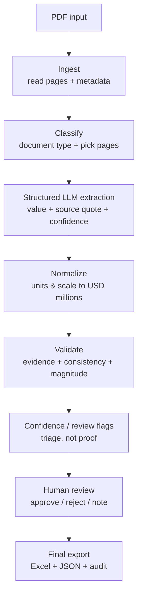

# Simple Live Batch Run

Use this path when you have a folder of earnings PDFs and want one Excel file.
Run these commands from the project root.

## 1. Create and activate Python

```bash
python -m venv .venv
source .venv/bin/activate
```

## 2. Install the project

```bash
python -m pip install -e ".[dev]"
```

## 3. Prepare live mode

Live mode calls OpenAI, so it needs an API key. Copy the example environment
file, then edit `.env` and fill in `OPENAI_API_KEY`.

```bash
cp .env.example .env
```

Your `.env` should look like this:

```bash
OPENAI_API_KEY=your_api_key_here
OPENAI_MODEL=gpt-5.4-mini
OPENAI_REASONING_EFFORT=low
```


## 4. Put PDFs in the input folder

Create the folder used by the batch command and put all PDFs there.

```bash
mkdir -p pdf_input_copy
```

Example:

```bash
cp /path/to/your/pdfs/*.pdf pdf_input_copy/
```

If your folder is named `pdf_input` instead, either rename it to
`pdf_input_copy` or change the command below to use `pdf_input`.

## 5. Run the batch

```bash
python -m earnings_extractor batch pdf_input_copy --out outputs/pdf_input_batch/extractions.xlsx --mode live
```

## 6. Check the output

The expected Excel workbook is:

```text
outputs/pdf_input_batch/extractions.xlsx
```

Open `extractions.xlsx` and go to the **Extraction Draft** tab to check the
extracted details. The workbook is a draft batch export, so it also includes
review tabs that show each extracted field, source page, quote, confidence, and
any reason a field needs human review.

---

# Earnings Extractor

Review-first extraction of standard financial metrics from earnings PDFs and
earnings-call transcripts, into a client-compatible Excel workbook plus JSON and
audit artifacts.

[Live Demo](https://project-ee-one.vercel.app/)

**This is not just "an LLM extracts numbers."** It is:

> **LLM draft extraction → deterministic validation → citation review → approved Excel export.**

The language model only does the fuzzy reading task: find each metric, quote the
sentence it came from, and report a confidence. Everything that has to be
reliable — unit and scale conversion, identity cleanup, unsupported-field
handling, consistency checks, review flags, and final Excel formatting — is
fixed, testable code. Numbers reach the client workbook only after a human
approves the citation behind them.

---

## Architecture / Data Flow




Stage by stage, in plain English:

1. **Ingest** — read the PDF into per-page text plus document metadata.
2. **Classify** — decide the document type (earnings report vs. earnings-call
  transcript) and select the pages worth extracting from, so the model isn't
   fed the whole filing.
3. **Structured LLM extraction** — a single constrained, schema-bound model call
  returns each metric as `{value, source_page, source_quote, confidence}`. The
   orchestration is fixed code; the model never decides control flow.
4. **Normalize** — convert every currency value to **USD millions** (the client
  template's scale), gross margin to percentage points, and EPS to a plain
   per-share number. Deterministic math, not the model's arithmetic.
5. **Validate** — check that each value is backed by a real quote, that the quote
  is actually on the cited page, that the number appears in its own quote, and
   that cross-field consistency (e.g. free cash flow) and magnitude sanity bounds
   hold.
6. **Confidence / review flags** — anything uncertain or unsupported is flagged
  for a human. Confidence is **review triage, not proof** (see below).
7. **Human review** — a static review page shows every value with its page,
  quote, confidence, and flag reason, and records approve / reject / note
   decisions.
8. **Final export** — only approved values are written to the client Excel
  template, alongside a JSON snapshot and a Markdown audit trail.

---

## Confidence and Review Logic

Confidence is a **triage signal that decides what a human looks at first — it is
never treated as proof that a value is correct.** A high model confidence never
lets a value skip validation, and validation never edits a value; it only marks
`needs_review` with a reason.

A value is routed to human review when **any** of these is true:

- model confidence is below the review threshold (`0.75`);
- the source quote is missing;
- the quote is not found on the cited page;
- the extracted number is not grounded in the quote (its digits don't appear);
- a required client-template field is blank;
- the field is unsupported or not meaningful for the document type (e.g.
operating income / gross margin on a bank transcript);
- a consistency check fails (operating cash flow − capex must reconcile to free
cash flow within tolerance);
- a magnitude check fails (net income / operating income shouldn't exceed total
revenue; gross margin must sit in a sane percentage range).

This is what makes the system feel trustworthy: the reviewer's queue is short
because clean values pass through, and every flagged value carries a concrete,
human-readable reason.

---

## Understanding the Excel Workbook

The reviewed export (`extractions.xlsx`) has four sheets:


| Sheet                | What it contains                                                                                  |
| -------------------- | ------------------------------------------------------------------------------------------------- |
| **Client Template**  | First sheet, matches the client's exact columns and formatting. Only approved values appear here. |
| **Metrics**          | Normalized extracted values plus their per-field review decision.                                 |
| **Review Decisions** | The approve / reject / not-applicable / note record for each metric.                              |
| **Evidence**         | Source page, quote, confidence, and the review-flag reason for every metric.                      |


The first worksheet uses the client's exact columns:

```text
Company Name | Quarter | Total revenue | Earnings per share | Net income
| Operating income | Gross margin | Operating expenses | Buybacks and dividends
```

Cell formatting rules:

- **Revenue / net income / operating income / operating expenses** render as
`$<n>B` (stored as USD millions, divided by 1000 for display).
- **Gross margin** renders as a real percentage cell.
- **Earnings per share** is a plain number.
- **Unsupported or unapproved values stay blank** — the tool never guesses a
number into the client sheet.

A workbook exported from synthetic or unreviewed decisions is clearly marked as
`DRAFT/UNREVIEWED` (amber tab, comment on the header cell). A "final" workbook
requires real human review decisions.

---

## Quickstart

Create a virtual environment and install the package:

```bash
python -m venv .venv
source .venv/bin/activate
python -m pip install -e ".[dev]"
```

### Batch a folder of PDFs → one Excel file (the simple path)

If you just want to run a stack of PDFs and get a spreadsheet, use `batch`. Drop
your PDFs in a folder and point the command at it:

```bash
mkdir -p pdf_input          # drop your PDFs in here
cp /path/to/*.pdf pdf_input/

python -m earnings_extractor batch pdf_input --out outputs/extractions.xlsx
```

That's it — one command in, one `.xlsx` out. `pdf_input` and
`outputs/extractions.xlsx` are the defaults, so `python -m earnings_extractor batch` alone works too.

Key properties for batch runs:

- **One bad PDF never fails the batch.** Corrupt, encrypted, scanned-image, or
non-earnings files are recorded and skipped; every other PDF still processes.
- **A company missing some metrics never blocks the export.** Missing fields are
left blank instead of aborting the workbook (no more "Export blocked").
- **You can always see the results.** Every extracted value is written to the
client sheet immediately. Because nothing has been human-reviewed yet, the
workbook is clearly stamped `DRAFT/UNREVIEWED` (amber tab).
- **Nothing is silent.** The workbook opens on **Review Instructions**, then
**Extraction Draft** shows the client-template draft. The review instructions
explain the colors, and **Review Queue** lists every field as `OK`,
`NEEDS REVIEW`, or `NOT DISCLOSED` with the reason, source page, and quote.
Colored cells on the draft sheet match that legend, and flagged/blank cells
carry comments.

Live mode needs `OPENAI_API_KEY` (see [Live Mode](#live-mode)). To try the batch
path offline against the two bundled samples, add `--mode recorded`.

> For careful, auditable single-document work — approve/reject each citation
> before anything reaches the client sheet — use the review-first workflow below
> or the web app. `batch` is the fast lane; the steps below are the rigorous one.

### CLI quickstart (no API key required)

This is the reviewer path. Recorded mode replays committed model responses, so it
runs deterministically and offline:

```bash
python -m earnings_extractor extract assesment_info --out outputs/run_001 --mode recorded
python -m earnings_extractor inspect outputs/run_001/draft_metrics.json
python -m earnings_extractor review outputs/run_001 --out outputs/run_001/review.html --demo-decisions outputs/run_001/review_decisions.json
python scripts/make_acceptance_decisions.py outputs/run_001 --out outputs/run_001/human_review_decisions.json
python -m earnings_extractor export outputs/run_001 --decisions outputs/run_001/human_review_decisions.json --out outputs/extractions.xlsx
```

Open `outputs/run_001/review.html` to see the citation review page, and
`outputs/extractions.xlsx` for the exported workbook.

### Web app

A Next.js shell wraps the same Python pipeline — it does not reimplement
extraction, normalization, validation, or export in JavaScript.

Production deployment: [https://project-ee-one.vercel.app/](https://project-ee-one.vercel.app/)

```bash
# terminal 1: Python API wrapper over the existing extractor/export code
.venv/bin/python scripts/web_api_server.py --port 8000

# terminal 2: Next.js frontend, proxying /api/process to the Python API
PYTHON_API_BASE_URL=http://127.0.0.1:8000 npm run dev -- --port 3000
```

Then open `http://localhost:3000`. Sample mode runs the two bundled reference
PDFs with no API key. Upload mode accepts arbitrary PDFs and uses
`OPENAI_API_KEY` server-side only. Downloaded workbooks from the web UI are
explicitly marked draft/unreviewed.

### Run tests and evals

```bash
python -m earnings_extractor extract assesment_info/TSLA-Q2-2025-Update.pdf --out outputs/test_tesla --mode recorded
python -m earnings_extractor eval --draft outputs/test_tesla/draft_metrics.json --document-id tesla_q2_2025 --min-accuracy 0.9

python -m earnings_extractor extract assesment_info/citi_earnings_q12025.pdf --out outputs/test_citi --mode recorded
python -m earnings_extractor eval --draft outputs/test_citi/draft_metrics.json --document-id citi_q1_2025 --min-accuracy 0.9

pytest -q
ruff check .
python3 scripts/update_project_map.py --check
```

The full submission gate is in `docs/VERIFY.md`.

---

## Output Artifacts

Draft extraction writes:

- `draft_metrics.json` — normalized draft rows, evidence, validation flags, and
live token usage when available.
- `review_queue.json` — rows requiring approval, rejection, or not-applicable
decisions.
- `evidence_report.md` — citation-oriented audit summary.
- `review.html` — local static review page with source page, quote, confidence,
validation status, and decision controls.

Reviewed export writes:

- `extractions.xlsx` — the four-sheet workbook described above.
- `extractions.json` — final reviewed data.
- `extractions.audit.md` — export/audit summary.

---

## Accuracy

The eval target is field-level accuracy over the client-template fields, scored
against golden values in `evaluation/` (see `docs/EVAL_SPEC.md`). Golden values
live only in `evaluation/`; runtime extraction code never imports them, and a
test enforces that separation.

Current recorded eval gate:

- Tesla Q2 2025: `9/9` (`100%`)
- Citi Q1 2025: `9/9` (`100%`)

The comparison in `docs/LLM_VS_PIPELINE.md` shows why the deterministic layer is
worth keeping: on the reproducible recorded A/B, the same raw model outputs move
from `15/18` (`83.3%`) to `18/18` (`100%`) after normalization, enrichment, and
validation. A live supporting A/B run on 2026-06-01 moved from `12/18` (`66.7%`)
to `17/18` (`94.4%`); the remaining miss was a quarter-text mismatch, not a
numeric or scale error.

---

## Live Mode

Live mode uses the OpenAI Responses API with structured outputs. It is optional
for reviewers because recorded mode replays committed model responses.

Create `.env` from `.env.example` and set:

```bash
OPENAI_API_KEY=...
OPENAI_MODEL=gpt-5.4-mini
OPENAI_REASONING_EFFORT=low
```

Then run:

```bash
python -m earnings_extractor extract assesment_info/TSLA-Q2-2025-Update.pdf --out outputs/live_tesla --mode live
```

Live drafts include `llm_usage`, copied from the OpenAI response usage object.
Reasoning tokens are stored as a breakdown but are not added separately to cost;
they are already included in `output_tokens`.

### Cost

Client baseline from `docs/CLIENT_REPLY.md`: analysts cost about `$50/hour` and
process `10–15 PDFs/hour`, or roughly `$3.33–$5.00/PDF`.

Measured live run on `TSLA-Q2-2025-Update.pdf` with `gpt-5.4-mini`: `6,422` input

- `1,967` output tokens at `$0.75 / 1M` input and `$4.50 / 1M` output, for about
`**$0.0137/PDF**` — roughly `244×–366×` cheaper than the analyst baseline before
routine local compute. Document length varies, so this is a sample, not a
universal average.

---

## Limitations

- V1 scope is earnings report PDFs and earnings-call transcripts only.
- The golden eval set has two validated companies; production should expand to
30–50+ labeled documents across industries.
- Recorded mode is the required reproducible path. Live mode depends on API
credentials and current model behavior.
- The web UI exports an explicitly marked unreviewed draft workbook; a full
inline accept/edit/reject review surface remains future work.
- Synthetic review decision files are for deterministic verification only;
production use requires real human review.

## Production Path

The next production sprint should expand the eval set, add confidence calibration
from historical outcomes, connect document ingestion to the client's real
workflow, and move the local review artifact into a persistent multi-user review
queue with audit logs, SSO/RBAC, and monitoring for accuracy, review rate,
failure rate, and cost per document.

## Deployment Notes

- `api/process.py` is the Vercel Python function candidate.
- `vercel.json` sets `maxDuration` to `300` seconds for Python API functions.
- If a mixed Next.js + Python Vercel project does not route Python functions,
deploy the Python API on Render/Railway/Fly and set `PYTHON_API_BASE_URL` in
the Vercel frontend environment.

